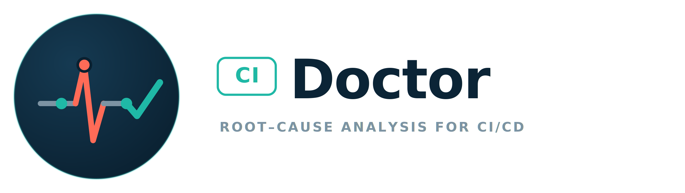

<p align="center">
  <picture>
    <source media="(prefers-color-scheme: dark)" srcset="docs/site/public/ci-doctor-logo-dark.svg">
    
  </picture>
</p>

<p align="center">
  <strong>Root-cause analysis for CI/CD.</strong><br>
  A postmortem step that runs when a pipeline fails, works out <em>where</em> and <em>why</em> it broke,
  and emits a structured report — without ever touching your code.
</p>

<p align="center">
  
  
  
  
</p>

---

When a pipeline fails, the logs are long and loud. An LLM handed the whole trace will
confidently blame the runner or a missing cache — because that text is alarming — even
when the real failure was an `exit code 1` three sections down. ci-doctor fixes that with
one rule:

> **Deterministic code decides *where* the job failed. The LLM only explains *why*.**

Phase attribution is a pure function of job metadata and log structure, computed **before**
any model is called. A loud, non-fatal `WARNING:` can never outrank the actual failure. If
the classifier is wrong, that's a bug with a failing test — not a prompt to tune.

## Features

- **Deterministic phase attribution** — a pure, fully-tested classifier decides where a job
  broke (`provision` · `prepare` · `fetch` · `script` · `post`) from metadata and log
  structure. Non-fatal `WARNING:` lines can never be blamed.
- **Read-only and safe** — never edits code, commits, or opens MRs, and **always exits 0**,
  so it can't change your pipeline's status or hide the real failure.
- **Useful with no LLM** — ships a deterministic report out of the box: phase, reason,
  terminal command, evidence excerpt, and templated remediation.
- **Bring-your-own model** — optional LLM step via `openai` (any OpenAI-compatible endpoint),
  `litellm`, `anthropic`, or the local `claude` CLI, selected by config.
- **GitLab & GitHub** — one provider-neutral core; the GitHub adapter was added with *zero*
  changes to core.
- **Air-gap friendly** — no telemetry, no update checks, no runtime downloads; ship as a
  self-contained Docker image or an offline wheel bundle.
- **Secret redaction** — scrubs secrets from the prompt *and* the report (round-trip tested).
- **Structured output** — a rich terminal report, `report.md` + `report.json` artifacts (with
  a self-contained `handoff_prompt` you can paste into a coding agent), and one idempotent
  MR/PR note.

## How it works

```
acquire → segment → attribute → denoise → extract → budget → (LLM) → render / deliver
          └── deterministic: decides WHERE it failed ──┘        └── explains WHY ──┘
```

1. **Acquire** the failed jobs and their logs (a missing log is valid data — the
   "never got a runner" case).
2. **Segment** the trace into sections (GitLab `section_*` markers / GitHub `##[group]`).
3. **Attribute** the failure to a phase — the pure classifier, first-match-wins precedence
   ladder with a `WARNING:`-is-never-fatal rule.
4. **Denoise / extract / budget** the blamed section into a small, high-signal evidence slice
   (ANSI/CR/dedup denoising, anchored windows, token budgeting — every truncation is visible).
   Shipped matcher packs cover pytest/jest/go/maven/gradle/bazel, Rust, .NET, Ruby, PHP,
   node + npm/pnpm/yarn/bun, Playwright/Cypress, tsc/eslint/mypy, Docker and Terraform;
   add your own under `extraction.matchers` — they merge onto the shipped packs by id.
5. **LLM (optional)** explains the cause *within* the already-decided phase, returning a
   validated JSON report. Disabled or unreachable → deterministic report instead.
6. **Render / deliver** to the terminal, `report.md`/`report.json`, and an idempotent MR/PR note.

## Install

> On PyPI the distribution is **`ci-doctorr`** (the `ci-doctor` name was taken); the import package is `ci_doctor` and the command stays `ci-doctor`.

```sh
git clone https://github.com/fennet82/ci-doctor
cd ci-doctor
uv sync                       # or: pip install .

# optional LLM backends:
uv sync --extra anthropic     # or: pip install '.[anthropic]'  /  '.[litellm]'  /  '.[all]'
```

Or build the self-contained image:

```sh
docker build -t ci-doctor .
```

## Quickstart

```sh
# Replay a captured log offline — no network, no LLM:
uv run ci-doctor analyze failing-job.log

# Against a live pipeline (reads $CI_PIPELINE_ID etc. inside CI):
uv run ci-doctor analyze "$CI_PIPELINE_ID"
```

```
ci-doctor analyze [TARGET] [OPTIONS]

  TARGET             A pipeline/run id, or a path to a raw job log to replay
                     offline (no network fetch).
  --job-id TEXT      Analyze a single job id.
  -f, --config PATH  Path to .ci-doctor.yml. Repeatable; the last one wins.
  --no-color         Disable coloured output (also honours NO_COLOR).
  -v, --verbose      Enable debug logging.
  --version          Show version and exit.

ci-doctor config [OPTIONS]

  --diff             Show only what your config changes vs the shipped defaults,
                     git-diff style: green added, red replaced.
  --schema           Print the JSON Schema for .ci-doctor.yml.
  --validate         Load every layer and report what fails validation.
  -f, --config PATH  Path to .ci-doctor.yml. Repeatable; the last one wins.
  --less / --plain   Force / skip the scrollable pager (paged on a terminal).
```

## Configuration

Layered and pydantic-validated — `defaults.yml` < repo `.ci-doctor.yml` < `CI_DOCTOR_*` env
< CLI flags. Unknown keys are an error. Run `ci-doctor config --diff` to see exactly what
your layers changed. Minimal config:

```yaml
provider: gitlab

gitlab:
  base_url: https://gitlab.com        # default; override for self-hosted
  token_env: CI_DOCTOR_GITLAB_TOKEN   # or gitlab.token_file for a secret mount

llm:
  enabled: true                       # false => deterministic-only report
  backend: openai                     # openai | litellm | anthropic | claude_code
  model: qwen2.5-coder:32b
  api_base: http://openai-compatible-endpoint.internal:8000/v1
```

Nested env vars use `__`: `CI_DOCTOR_LLM__MODEL=…`. See the full reference in
[docs/site](docs/site) or [docs/PLAN.md §9](docs/PLAN.md).

### LLM backends

| `llm.backend` | Calls | Needs |
|---|---|---|
| `openai` *(default)* | any OpenAI-compatible endpoint (Ollama, vLLM, llama.cpp, gateway) | `model` + `api_base` — base install |
| `litellm` | any [litellm](https://docs.litellm.ai/) provider | `model`; `pip install '.[litellm]'` |
| `anthropic` | Claude via the official SDK (defaults to `claude-opus-4-8`) | API key / `ant` profile; `'.[anthropic]'` |
| `claude_code` | the local `claude` CLI, headless | `claude` on PATH |

The LLM step is optional throughout — when it's disabled, unconfigured, or unreachable,
ci-doctor emits the deterministic report instead of failing.

## Use it in CI

**GitLab** (`.gitlab-ci.yml`) — runs only on failure, always exits 0:

```yaml
ci-doctor:
  stage: .post
  image: registry.internal.example.com/ci-doctor:latest
  rules:
    - when: on_failure
  allow_failure: true
  variables:
    CI_DOCTOR_GITLAB_TOKEN: "$CI_DOCTOR_TOKEN"
  script:
    - ci-doctor analyze "$CI_PIPELINE_ID"
  artifacts:
    when: always
    paths: [report.md, report.json]
```

**GitHub Actions** — triggered on a failed workflow run. Full examples in
[`examples/`](examples/).

## Air-gapped / offline

ci-doctor makes no network calls except to the GitLab/GitHub and LLM endpoints you
configure. Build once where there is internet, then ship inside — a Docker image, or an
offline wheel bundle (`pip install --no-index --find-links ./wheels ci-doctorr`). See
[docs/OFFLINE.md](docs/OFFLINE.md).

## Documentation

A full documentation site (overview, requirements, configuration, usage, CI/CD examples)
lives in [`docs/site/`](docs/site) — built with Astro:

```sh
cd docs/site && npm install && npm run dev    # or: npm run build -> dist/
```

The original design spec is [docs/PLAN.md](docs/PLAN.md). How to work in this repo —
where code goes, how to write tests, commit conventions — is
[CONTRIBUTING.md](CONTRIBUTING.md).

## Development

```sh
uv sync
uv run pytest        # 172 tests, no network, no LLM
```

```
ci_doctor/
  cli.py            typer entrypoint (always exits 0)
  config/           pydantic schema + defaults.yml + layered loader
  core/             provider-neutral: models, ports, attribution (pure), denoise,
                    extract, budget, redact, analyze
  llm/              Report schema, prompt templates, backends (openai/litellm/anthropic/claude_code)
  render/           terminal (rich), markdown, json
  providers/
    gitlab/         python-gitlab adapter + segmenter + reasons
    github/         GitHub Actions adapter + segmenter + reasons
tests/              fixtures + golden-file attribution suite
docs/site/          Astro documentation site
examples/           .gitlab-ci.yml + GitHub Actions snippets
Dockerfile
```

### Design guardrails

- The LLM never selects the failure phase — that lives in `core/attribution.py`.
- `core/` depends on no provider or vendor SDK — `grep -riE 'gitlab|github|openai' ci_doctor/core/`
  is clean. Adding the GitHub adapter required no core changes.
- `attribution.py` is a pure function — no I/O, network, or clock.
- Always exits 0 · never emits unredacted log content · every truncation is visible.

## License

[MIT](LICENSE) © Elad Cohen
