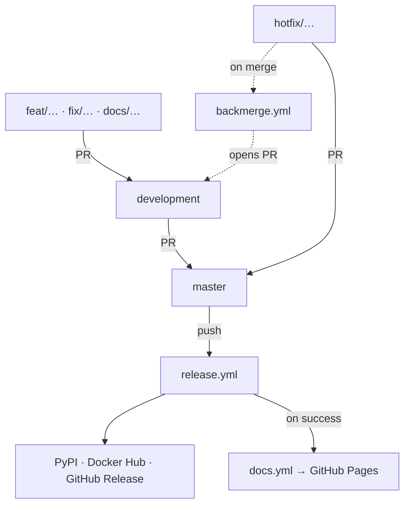

# The pipelines

What runs where, and why it runs there. The branch rules themselves are
[CONTRIBUTING §3](../CONTRIBUTING.md#3-branches); this is the CI side of them.

One rule shapes the whole thing: **a check lives at the cheapest point that can
catch it.** Fast feedback on feature branches, expensive checks once per
integration, publishing only on `master`.

---

## The flow

The diagram is the topology — who merges into whom, where `hotfix/` skips the
queue, and how a hotfix finds its way back. The table under it is the checks.

Dotted is the backmerge: it opens a PR rather than pushing, so the hotfix lands
in `development` through the same review as anything else.

| Hop | Workflows |
|---|---|
| `<type>/<slug>` → `development` | `ci` · `security` |
| `hotfix/<slug>` → `master` | `ci` · `security` · `release-gate` |
| `development` → `master` | `ci` · `security` · `release-gate` |
| push to `master` | `release`, then `docs` on its success |
| hotfix merged | `backmerge` |

A hotfix gets the release gate because a hotfix ships — the same packaging and
image checks apply to it as to an integration.

---

## `ci.yml`

Jobs are independent so one red check names the kind of problem.

| Job | Does | Notes |
|---|---|---|
| `conventions` | Branch name is `<type>/<slug>`; every commit subject is a Conventional Commit | Only for PRs into `development`, or from a `hotfix/` branch. The `development → master` PR is an integration and carries no type prefix. |
| `test` | `pytest --cov` on Python 3.11–3.14 | `fail-fast: false` — *which* versions break is the useful answer. Coverage lands on the run summary page. |
| `lint` | `ruff check` (incl. `S`), `ruff format --check`, markdown formatting, `ty` | `ty` runs over `ci_doctor` only: a type error in the shipped package is what reaches a user. |
| `docs` | `npm run build` of the site | Build only. Publishing is `docs.yml`, so a PR cannot touch what is live. |
| `leaks` | `gitleaks` over the PR's whole history | `fetch-depth: 0` — a secret added and then removed is still a leak. |

**`hotfix` is a branch prefix, not a commit type.** The two lists in `conventions`
are deliberately different: `hotfix/urgent-thing` is a valid branch, `hotfix: …`
is not a valid commit subject.

## `security.yml`

Separate from `ci.yml` for one reason: **the weekly cron**. A CVE is published
after your last commit, so without a schedule it would surface only on whatever
PR happens next — which for a small team can be weeks.

| Job | Does |
|---|---|
| `codeql` | GitHub's dataflow analysis for Python. Findings land in the repo's Security tab. |
| `deps` | `pip-audit` over the locked runtime dependencies, against the OSV database. `--no-dev`: an SBOM and a CVE report should describe what a user installs, not our tooling. |
| `actions` | `zizmor` over the workflow files themselves — script injection via `${{ }}`, over-broad permissions, loose action refs. |

`ruff`'s `S` ruleset (flake8-bandit) is the fourth piece and runs inside `ci.yml`'s
`lint` job, because ruff already vendors it — no extra tool, no extra job.

**zizmor policy.** [`.github/zizmor.yml`](../.github/zizmor.yml) sets `ref-pin`
rather than the default `hash-pin`. Hash-pinning is stricter, but only pays off
with a bot to bump the hashes; without one it just freezes actions wherever they
were the day they were added. Two findings are suppressed inline, each with its
reason at the suppression site.

## `release-gate.yml`

The slow lane: everything the release is about to do, minus publishing. Runs on
PRs into `master` only.

| Job | Does |
|---|---|
| `distributions` | `uv build` + `twine check` — catches the metadata problems PyPI rejects on upload. |
| `image` | `docker build` |
| `schema` | `ci-doctor config --schema` still generates valid JSON |
| `sbom` | The CycloneDX SBOM generates and parses |

It exists because by the time `release.yml` runs, it has already bumped the
version, committed, and pushed the tag. A Dockerfile or packaging error at that
point leaves a tag with no release behind it — which is exactly how the first
alpha failed. This is the last place those are cheap to find.

## `release.yml`

Runs on every push to `master`, but publishes only when there is something to
publish: the `gate` step looks for a `feat`/`fix`/`BREAKING CHANGE` commit since
the last tag. Docs and chores ride along in the next alpha rather than cutting one
of their own.

In order: bump to the next alpha → commit + annotated tag (pushed `--atomic`) →
build sdist and wheel → build the image and save it as a gzipped tar → push the
image to Docker Hub → generate the config schema → generate the SBOM → attest
provenance → create the GitHub Release with all assets → publish to PyPI via
Trusted Publishing.

**Docker Hub.** Images go to [`fennet/ci-doctor`](https://hub.docker.com/r/fennet/ci-doctor)
as `:<version>` and `:latest`. Note the name differs from the PyPI distribution,
which is `ci-doctorr` — the `ci-doctor` name was already taken on PyPI. The import
package and the command are `ci_doctor` / `ci-doctor` everywhere.

The gzipped tar asset stays on the Release regardless. That is the air-gap path,
and pushing to a registry does not replace it.

**Provenance.** `actions/attest-build-provenance` signs the distributions and the
image digest, so a user can verify what built them. The image attestation is
pushed to the registry alongside the image.

**Caching is off in this job.** A restored cache is writable by any branch's
workflow; in a job that publishes, that trades a few seconds for a wider supply
chain.

## `docs.yml`

Builds `docs/site` and deploys to GitHub Pages. **Triggered by `release.yml`
completing**, not by a push.

That indirection fixes a real bug. The site reads its version from
`pyproject.toml` ([`src/lib/version.ts`](site/src/lib/version.ts)), and
`release.yml` bumps that file *during* its own run, committing it with `[skip ci]`.
Building on the push meant rendering the commit before the bump, so the published
site permanently trailed the latest release by one. Worse, the trigger was
path-filtered to `docs/site/**`, so a release touching no docs did not rebuild at
all and the site could sit several versions stale.

Two details make it work:

- **`release.yml` runs on every push to `master`**, and its "is there anything to
  release?" check is a *step*, not a workflow-level skip. So a docs-only push still
  runs it to completion and still triggers this workflow.
- **The checkout pins `ref: master`.** For `workflow_run`, `actions/checkout`
  defaults to the SHA of the *triggering* run — the pre-bump commit. A version of
  this without that line reproduces the exact bug it was written to fix.

Deploys are skipped when the release failed, so the site never advertises a version
that did not ship. `workflow_dispatch` is the manual retry.

## `backmerge.yml`

A hotfix reaches `master` without passing through `development`, so `development`
ends up missing it — and the next `development → master` integration silently
reverts the fix. On a merged `hotfix/*` PR, this opens a `master → development` PR.

Only for hotfixes, deliberately: a normal integration merge also leaves `master`
ahead of `development`, so a plain "is master ahead?" check would fire on every
single release.

The PR uses `--head master` rather than a snapshot branch, so it tracks the tip as
`master` moves — including the release commit that lands moments later.

> **Known limitation.** PRs opened with `GITHUB_TOKEN` do not trigger workflows, so
> the back-merge PR arrives without check runs. The content is already on `master`,
> which was fully gated on the way in, so this is a display gap rather than a hole.
> Closing it properly needs a PAT or a GitHub App, which is not worth the credential
> at this size.

---

## Secrets

| Secret | Used by | Absent behaviour |
|---|---|---|
| `DOCKERHUB_USERNAME` | `release.yml` | The push steps skip; the release still completes and the tarball is still attached. |
| `DOCKERHUB_TOKEN` | `release.yml` | As above. Use a Docker Hub access token, not the account password. |

`GITHUB_TOKEN` is provided automatically. PyPI needs no secret — Trusted Publishing
authenticates over OIDC against a publisher configured for this repo and workflow.

---

## Adding a check

Put it where it is cheapest to catch, not where it is easiest to write:

- **Fast, and catches a mistake a contributor makes often** → `ci.yml`.
- **Security posture, and worth re-running against unchanged code** → `security.yml`,
  so the cron picks it up.
- **Slow, and only matters at release time** → `release-gate.yml`.
- **Produces an artifact users consume** → `release.yml`, and add it to the Release
  assets so it is versioned with everything else.
